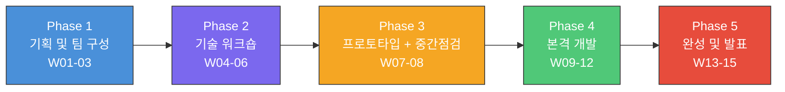
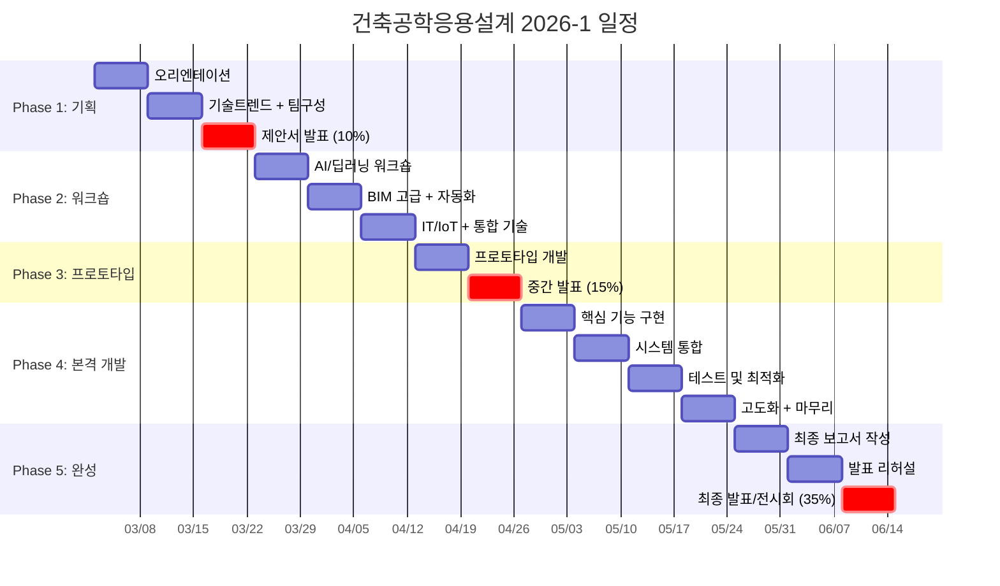

---
tags:
  - lecture/응용설계
  - "2026-1"
  - status/active
semester: 2026-1
---

# 강의일정 2026-1학기: 건축공학응용설계

> [!hypothesis] 수업 철학
> "배운 기술을 **융합**하여 실제 문제를 해결하는 **작품**을 만든다."
> 선수과목(Python, BIM, 구조)에서 익힌 개별 기술을 AI/BIM/IT로 통합하고,
> 팀 협업을 통해 건설산업의 혁신적 솔루션을 설계·구현·발표한다.

---

## Phase 흐름

---

## 15주 상세 계획

### Phase 1: 기획 및 팀 구성 (W01-03)

| 주   | 주제            | 형태     | 핵심 내용                                                                    | 산출물           |
| --- | ------------- | ------ | ------------------------------------------------------------------------ | ------------- |
| W01 | 오리엔테이션        | 강의     | 과목 소개, 캡스톤 디자인 개념, 우수 졸업설계 사례(국내외), 평가기준, 선수과목 복습                        | -             |
| W02 | 기술 트렌드 + 팀 구성 | 강의+활동  | 건설 AI/BIM/IT 최신 트렌드 (CV, 디지털트윈, LLM, IoT, 스마트건설), 팀 구성, 역할 배분, 주제 브레인스토밍 | 팀구성표, 후보주제 3개 |
| W03 | 프로젝트 제안서 발표   | **발표** | 팀별 10분: 주제 배경, 목표, 기술 스택, 일정, 예상 산출물                                     | **제안서 (10%)** |

### Phase 2: 기술 워크숍 (W04-06)

> [!method] 워크숍 형태
> 이론 30분 + 실습 2시간. 선수과목을 프로젝트 적용 관점에서 심화.

| 주 | 주제 | 형태 | 핵심 내용 | 산출물 |
|---|---|---|---|---|
| W04 | AI/딥러닝 워크숍 | 워크숍 | CV(OpenCV, YOLOv8), DL(PyTorch/TF), LLM API(Claude/GPT), Streamlit 프로토타입 UI | 실습 결과물 |
| W05 | BIM 고급 + 자동화 | 워크숍 | Revit API/Dynamo 자동화, ifcopenshell IFC 데이터 추출, BIM 물량 산출, BIM-구조해석 연동 | 실습 결과물 |
| W06 | IT/IoT + 통합 기술 | 워크숍 | IoT 센서 시각화, 웹 대시보드(Streamlit/Flask/Dash), 클라우드(Supabase), 디지털트윈 패턴, Git/GitHub 협업 | 실습 결과물 |

### Phase 3: 프로토타입 + 중간 점검 (W07-08)

| 주 | 주제 | 형태 | 핵심 내용 | 산출물 |
|---|---|---|---|---|
| W07 | 프로토타입 개발 | 멘토링+개발 | 핵심 기능 1-2개 구현, 교수 순회 멘토링 | MVP |
| W08 | **중간 발표** | **발표** | 팀별 15분: 프로토타입 시연, 기술적 도전/해결, 후반 계획 | **중간발표 (15%)** |

### Phase 4: 본격 개발 (W09-12)

> [!action] 주간 루틴
> 매주 시작 시 10분 스탠드업 미팅 → 개발 + 교수 멘토링

| 주 | 주제 | 형태 | 핵심 내용 | 산출물 |
|---|---|---|---|---|
| W09 | 핵심 기능 구현 | 멘토링+개발 | 중간발표 피드백 반영, 핵심 기능 완성, 데이터 파이프라인 | 주간보고 |
| W10 | 시스템 통합 | 멘토링+개발 | AI+BIM+IT 모듈 통합, API 연동, UI/UX 개선 | 주간보고 |
| W11 | 테스트 및 최적화 | 멘토링+개발 | 기능 테스트, 버그 수정, 성능 최적화, 사용자 시나리오 | 주간보고 |
| W12 | 고도화 + 마무리 | 멘토링+개발 | 추가 기능, 예외 처리, 배포 준비(Docker/Cloud) | 주간보고 |

### Phase 5: 완성 및 발표 (W13-15)

| 주 | 주제 | 형태 | 핵심 내용 | 산출물 |
|---|---|---|---|---|
| W13 | 최종 보고서 작성 | 멘토링+작업 | 보고서 가이드, 시스템 문서화(README, 아키텍처), 코드 정리 | **보고서 초안** |
| W14 | 발표 리허설 | 리허설 | 팀별 15분 리허설, 피드백, 자료 수정, 시연 점검 | 발표자료 최종 |
| W15 | **최종 발표/전시회** | **발표+전시** | 15분 발표+5분 질의, 포스터+시연 전시, 동료평가, (외부 심사 선택) | **발표/전시 (20%)**, **보고서 (15%)** |

---

## Gantt 차트

---

## 기술 스택 가이드

### AI

| 기술 | 용도 | 비고 |
|---|---|---|
| Python | 기본 프로그래밍 | 필수 |
| PyTorch / TensorFlow | 딥러닝 모델 | 택 1 |
| OpenCV | 컴퓨터 비전 | 영상 처리 |
| YOLOv8 | 객체 탐지 | 실시간 감지 |
| LLM API (Claude/GPT) | 자연어 처리 | RAG, 챗봇 |
| Scikit-learn | 머신러닝 | 분류/회귀 |
| LangChain | LLM 오케스트레이션 | RAG 파이프라인 |

### BIM

| 기술 | 용도 | 비고 |
|---|---|---|
| Revit API | BIM 자동화 | C# / Python |
| Dynamo | 비주얼 프로그래밍 | Revit 연동 |
| ifcopenshell | IFC 데이터 추출 | Python |
| IFC.js | 웹 BIM 뷰어 | Three.js 기반 |

### IT / IoT

| 기술 | 용도 | 비고 |
|---|---|---|
| Streamlit / Flask | 웹 UI | 프로토타입 |
| Plotly / Dash | 데이터 시각화 | 대시보드 |
| Supabase | 클라우드 DB | PostgreSQL |
| MQTT | IoT 프로토콜 | 센서 데이터 |
| Three.js | 3D 시각화 | 디지털트윈 |
| Git / GitHub | 버전 관리 | 협업 필수 |

### 최소 / 권장 요구사항

> [!question] 최소 요구사항
> - Python + AI 라이브러리 1개 이상
> - 웹 UI (Streamlit 등)
> - GitHub 저장소 운영

> [!finding] 권장사항
> - AI + BIM 또는 AI + IT 1개 이상 융합
> - 실제 데이터 활용 (실험, 현장, 공공데이터)
> - Docker 또는 클라우드 배포

---

## 관련 링크

- [[200-Lecture/건축공학응용설계/_MOC|건축공학응용설계 MOC]]
- [[200-Lecture/건축공학응용설계/00-Syllabus/평가전략_2026-1|평가전략]]
- [[200-Lecture/건축공학응용설계/00-Syllabus/프로젝트주제_가이드|프로젝트 주제 가이드]]
