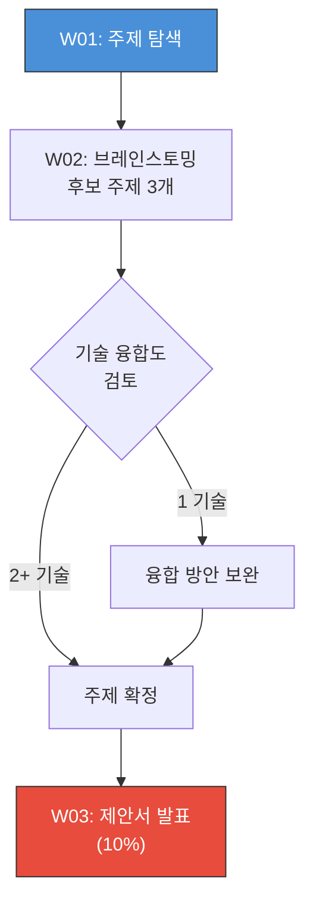

---
tags:
  - lecture/응용설계
  - "2026-1"
  - status/active
semester: 2026-1
---

# 프로젝트 주제 가이드: 건축공학응용설계

---

## 주제 선정 원칙

> [!question] 주제 선정 기준
> 1. AI, BIM, IT 중 **2개 이상 기술 융합** 권장
> 2. **실제 데이터** 활용 (실험, 현장, 공공데이터)
> 3. 15주 내 **MVP 구현 가능**한 범위
> 4. 건설/건축 분야의 **실무 문제 해결** 지향

---

## 프로젝트 주제 12선

### Category A: AI + 구조공학

| # | 주제 | 설명 | 기술 스택 | 난이도 | 교수연구연계 |
|---|---|---|---|---|---|
| 1 | AI 기반 구조 부재 설계 최적화 | 딥러닝으로 RC/Steel 부재 단면 최적화, 구조 성능 예측 | PyTorch, Scikit-learn, Streamlit | ★★★ | O |
| 2 | 콘크리트 균열 자동 감지/분류 | CV로 균열 이미지 탐지, 폭·길이 측정, 위험도 분류 | YOLOv8, OpenCV, Flask | ★★☆ | O |
| 3 | 구조 건전성 모니터링(SHM) 대시보드 | IoT 센서 + AI 이상감지 + 실시간 대시보드 | PyTorch, MQTT, Dash, Supabase | ★★★ | O |

### Category B: AI + BIM

| # | 주제 | 설명 | 기술 스택 | 난이도 | 교수연구연계 |
|---|---|---|---|---|---|
| 4 | BIM 자동 물량산출 + AI 견적 | IFC에서 물량 자동 추출, ML로 공사비 예측 | ifcopenshell, Scikit-learn, Streamlit | ★★☆ | - |
| 5 | LLM 건축법규 자동검토 (RAG) | BIM 모델 속성 + 건축법규 DB → LLM RAG 자동 적합성 검토 | LangChain, Claude API, ifcopenshell | ★★★ | - |
| 6 | BIM + IoT 디지털 트윈 | BIM 모델에 IoT 센서 데이터 실시간 연동, 3D 시각화 | IFC.js, Three.js, MQTT, Supabase | ★★★ | - |

### Category C: AI + IT/IoT

| # | 주제 | 설명 | 기술 스택 | 난이도 | 교수연구연계 |
|---|---|---|---|---|---|
| 7 | AI 건설현장 안전 모니터링 | CCTV 영상에서 안전장비 미착용, 위험구역 침입 실시간 감지 | YOLOv8, OpenCV, Streamlit, MQTT | ★★☆ | - |
| 8 | 건물 에너지 효율 최적화 | 에너지 사용 데이터 분석, ML 기반 소비 예측 및 절감 제안 | Scikit-learn, Plotly, Flask, Supabase | ★★☆ | - |
| 9 | AR 시공 가이드 시스템 | BIM 모델 기반 AR 시공 가이드, 현장-모델 오차 시각화 | Unity/ARKit, Revit API, Three.js | ★★★ | - |

### Category D: AI + 건축 일반

| # | 주제 | 설명 | 기술 스택 | 난이도 | 교수연구연계 |
|---|---|---|---|---|---|
| 10 | Generative AI 건축디자인 | 텍스트/스케치 → AI 건축 디자인 생성, 구조적 타당성 검증 | Stable Diffusion, ControlNet, Streamlit | ★★★ | - |
| 11 | 건축 도면 자동분석 (OCR+CV) | 도면 이미지에서 치수·부재·텍스트 자동 추출 및 DB화 | Tesseract, OpenCV, YOLOv8, Flask | ★★☆ | - |
| 12 | 스마트 PM AI 어시스턴트 | 공정관리 + LLM 챗봇 + 리스크 예측 대시보드 | LangChain, Claude API, Plotly, Supabase | ★★☆ | - |

---

## 기술 매핑표

| # | 주제 | AI | BIM | IT | 교수연구연계 | 난이도 |
|---|---|:---:|:---:|:---:|:---:|:---:|
| 1 | AI 기반 구조 부재 설계 최적화 | O | - | - | O | ★★★ |
| 2 | 콘크리트 균열 자동 감지/분류 | O | - | - | O | ★★☆ |
| 3 | 구조 건전성 모니터링(SHM) 대시보드 | O | - | O | O | ★★★ |
| 4 | BIM 자동 물량산출 + AI 견적 | O | O | - | - | ★★☆ |
| 5 | LLM 건축법규 자동검토 (RAG) | O | O | - | - | ★★★ |
| 6 | BIM + IoT 디지털 트윈 | - | O | O | - | ★★★ |
| 7 | AI 건설현장 안전 모니터링 | O | - | O | - | ★★☆ |
| 8 | 건물 에너지 효율 최적화 | O | - | O | - | ★★☆ |
| 9 | AR 시공 가이드 시스템 | - | O | O | - | ★★★ |
| 10 | Generative AI 건축디자인 | O | - | - | - | ★★★ |
| 11 | 건축 도면 자동분석 (OCR+CV) | O | - | - | - | ★★☆ |
| 12 | 스마트 PM AI 어시스턴트 | O | - | O | - | ★★☆ |

---

## 최소 요구사항 / 권장사항

### 최소 요구사항 (필수)

> [!deadline] 모든 팀이 반드시 충족해야 할 사항
> - [ ] **Python** 기반 프로젝트
> - [ ] **AI 라이브러리** 1개 이상 활용 (PyTorch, TF, Scikit-learn, LangChain 등)
> - [ ] **웹 UI** 구현 (Streamlit, Flask, Dash 등)
> - [ ] **GitHub 저장소** 운영 (커밋 이력, README, 브랜치 관리)
> - [ ] **실행 가능한 MVP** (최종 발표에서 라이브 시연)

### 권장사항 (가산점)

> [!finding] 높은 평가를 받기 위한 권장사항
> - [ ] AI + BIM 또는 AI + IT **2개 이상 기술 융합**
> - [ ] **실제 데이터** 활용 (실험 데이터, 현장 데이터, 공공데이터)
> - [ ] **Docker** 또는 **클라우드** 배포 (Supabase, AWS, GCP 등)
> - [ ] **테스트 코드** 작성 (단위 테스트, 통합 테스트)
> - [ ] **사용자 시나리오** 기반 UX 설계
> - [ ] 외부 데이터 API 연동 (기상청, 공공데이터포털 등)

---

## 주제 선정 프로세스

---

## 교수 연구 연계 주제 안내

> [!ref] 교수 연구실 연계
> 주제 #1, #2, #3은 교수 연구 분야(구조공학, AI 응용)와 직접 연계됩니다.
> - 연구 데이터 및 기존 코드 일부 활용 가능
> - 대학원생 멘토링 지원 가능
> - 우수 결과물은 학회 발표 또는 논문 투고 기회

---

## 관련 링크

- [[200-Lecture/건축공학응용설계/_MOC|건축공학응용설계 MOC]]
- [[200-Lecture/건축공학응용설계/00-Syllabus/강의일정_2026-1|강의일정]]
- [[200-Lecture/건축공학응용설계/00-Syllabus/평가전략_2026-1|평가전략]]
