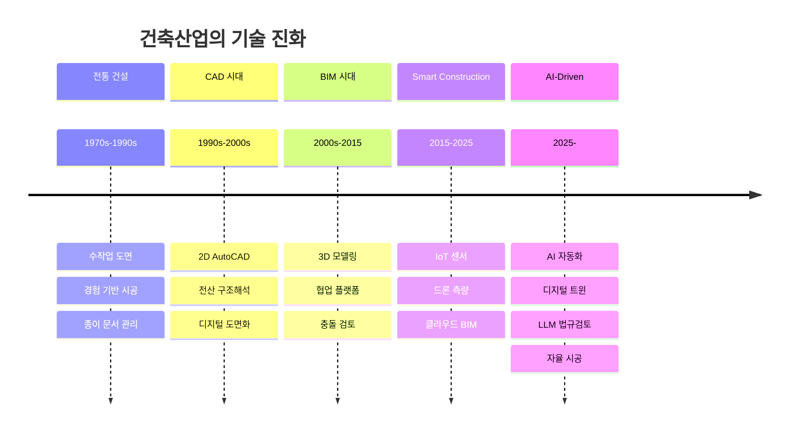
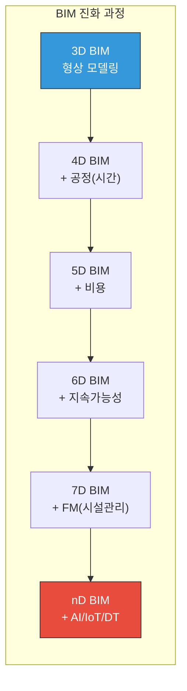
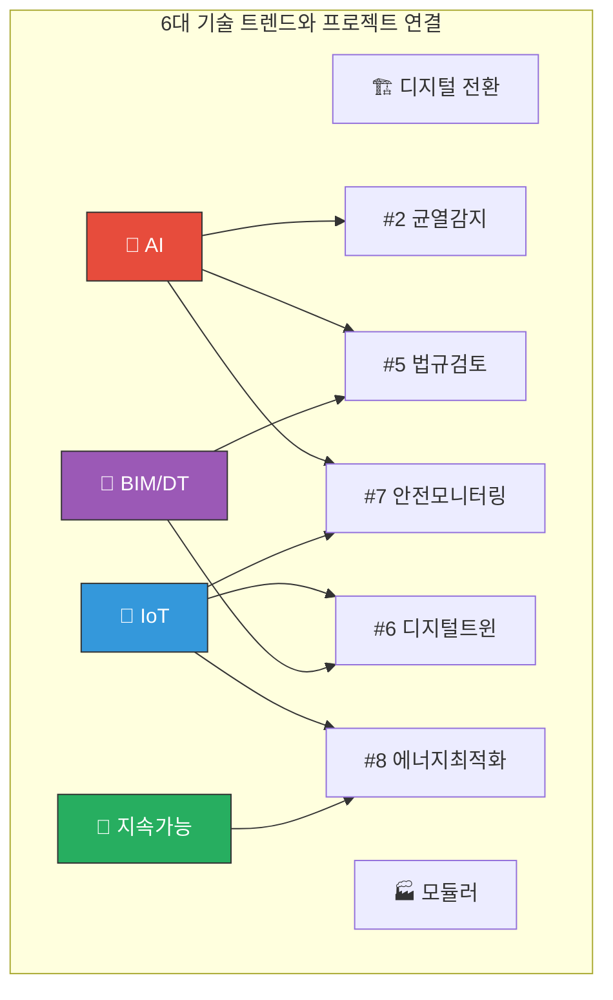
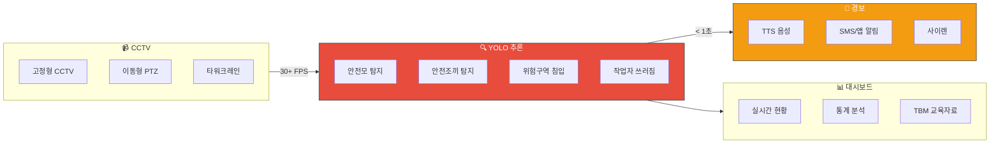
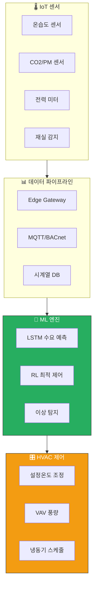
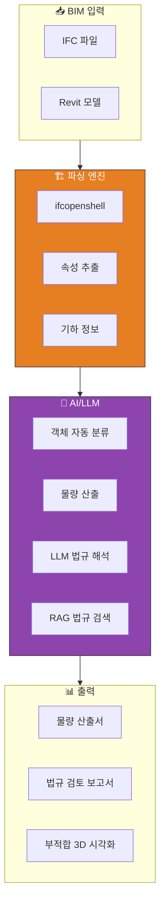
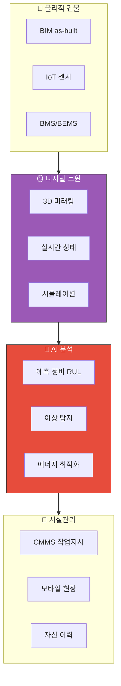
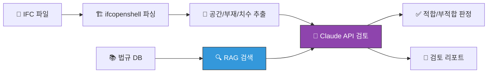
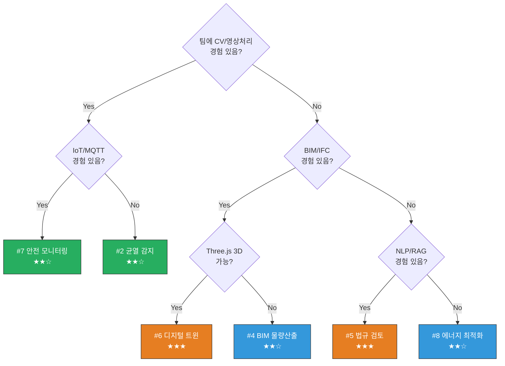

```mermaid
flowchart LR
    subgraph Sensors["📡 센서 계층"]
        S1[가속도계]
        S2[변형률계]
        S3[변위센서]
        S4[온습도센서]
    end

    subgraph Edge["⚡ 엣지 컴퓨팅"]
        E1[로컬 전처리]
        E2[이상치 필터링]
        E3[긴급 경보]
    end

    subgraph Cloud["☁️ 클라우드"]
        C1[데이터 저장]
        C2[장기 이력]
    end

    subgraph AI["🤖 AI 분석"]
        A1[CNN 손상 분류]
        A2[LSTM 이상 탐지]
        A3[잔존 수명 예측]
    end

    subgraph Dash["📊 대시보드"]
        D1[실시간 현황]
        D2[경보 알림]
        D3[보고서 생성]
    end

    Sensors --> Edge --> Cloud --> AI --> Dash

    style AI fill:#E74C3C,stroke:#333,color:#fff
    style Sensors fill:#3498DB,stroke:#333,color:#fff
```

---
tags:
  - lecture/응용설계
  - "2026-1"
  - status/active
course: 건축공학응용설계
semester: 2026-1
week: 2
topic: "기술 트렌드 + 팀 구성"
phase: "Phase 1: 기획 및 팀 구성"
date: "2026-03-09"
---

# Week 02: 기술 트렌드 + 팀 구성

---

## 📌 강의 중점

> [!hypothesis] 수업 철학
> "어떤 **기술**이 건설산업을 바꾸고 있는지 이해해야, 의미 있는 **프로젝트 주제**를 찾을 수 있다."
> 이 강의는 최신 기술 트렌드를 조망하고, 실제 적용 사례를 분석하여,
> 팀 프로젝트의 **주제 선정**과 **기술 스택 결정**의 기반을 마련한다.

**강의 구성**: 이론(90분) + 활동(60분)

| 시간 | 내용 | 형태 |
|------|------|------|
| 0:00-0:50 | Section 1: 현대 건축공학의 이슈와 발전 방향 | 강의 |
| 0:50-1:20 | Section 2: 스마트건축 어플리케이션 사례 | 강의+토론 |
| 1:20-1:40 | Section 3: 프로젝트 Product 예시 | 강의 |
| 1:40-2:30 | Activity: 팀 구성 & 주제 브레인스토밍 | 활동 |

---

## 🎯 학습 목표

1. 건설산업의 **6대 기술 트렌드**(AI, IoT, BIM, 모듈러, 지속가능, 디지털트윈)를 설명할 수 있다
2. 스마트건축 **5개 적용 사례**의 기술 구조와 기대 효과를 분석할 수 있다
3. 12개 프로젝트 주제 중 팀 역량에 맞는 **후보 주제 3개**를 선정할 수 있다
4. 팀을 구성하고 **역할을 배분**할 수 있다

---

## 🤔 왜 배우는가?

건설산업은 **가장 디지털화가 느린 산업** 중 하나였다. 하지만 AI, IoT, BIM의 융합으로 급속한 변화가 일어나고 있다. 이 흐름을 이해하지 못하면, 졸업 후 현장에서 기술 격차(Technology Gap)를 체감하게 된다.

> [!question] 핵심 질문
> "내가 졸업하는 시점에 건설산업은 어떤 기술을 요구할 것인가?"

---

## [Section 1] 현대 건축공학의 이슈와 발전 방향

---

### 1.1 건축산업의 디지털 전환

건설산업은 전통적으로 디지털화가 가장 더딘 산업이었으나, 2025년을 기점으로 **AI, 디지털 트윈, BIM 의무화**를 중심으로 급격한 디지털 전환이 이루어지고 있다.

> [!finding] 핵심 수치
> - 건설산업 AI 시장: 2024년 **$39.9억** → 2029년 **$118.5억** (CAGR 24.31%)
> - 72%의 조직이 2024년 기준 하나 이상의 사업 기능에 AI 도입 (McKinsey)
> - 국토교통부: BIM 도입 의무화 추진, 2026년부터 지능형 CCTV·스마트 경고 현장 적용

**Construction 4.0의 핵심 요소:**

| 기술 | 1세대 (수작업) | 2세대 (CAD/IT) | 3세대 (BIM) | **4세대 (AI/DT)** |
|------|-------------|---------------|------------|------------------|
| 설계 | 제도판 | AutoCAD | Revit/ArchiCAD | AI Generative Design |
| 시공관리 | 종이 일보 | 엑셀 | BIM 4D/5D | 디지털트윈 + AI |
| 안전관리 | 육안 순찰 | CCTV | IoT 센서 | AI 영상분석 + 예측 |
| 품질관리 | 현장 점검 | 사진 기록 | BIM 검토 | CV 자동 감지 |
| 법규 검토 | 수작업 대조 | 체크리스트 | Rule-based | **LLM + RAG** |

**국내 주요 동향:**
- **GS건설**: AI 기반 도면 검토 시스템으로 디지털 전환 가속화
- **한화 건설부문**: AI 영상분석 기반 실시간 사고예방 체계 구축
- **대우건설**: AI/로봇/디지털트윈 결합 스마트건설 선도 선언
- **국토교통부**: "AI가 인식할 수 있는 디지털 건설기준 시대" 선언 (2025.12)

> [!ref] 출처
> - Deloitte, "2025 Engineering & Construction Industry Outlook"
> - McKinsey, "The state of AI in 2024"
> - Mordor Intelligence, "AI in Construction Market"

<iframe width="560" height="315" src="https://www.youtube.com/embed/pG3-hvgoZFs" title="건설 혁신 다큐멘터리: 신기한 스마트 건설 기술들" frameborder="0" allow="accelerometer; autoplay; clipboard-write; encrypted-media; gyroscope; picture-in-picture" allowfullscreen></iframe>

---

### 1.2 AI in Construction

2025년 건설산업에서 AI는 단순 자동화를 넘어 **컴퓨터 비전(CV), 대규모 언어모델(LLM), Generative Design, 예측 분석(Predictive Analytics)** 등 전방위적으로 활용되고 있다.

**AI 적용 4대 분야:**

| 분야                       | 기술               | 적용 예시                   | 성과                     |
| ------------------------ | ---------------- | ----------------------- | ---------------------- |
| **Computer Vision**      | YOLO, CNN        | 균열 감지, PPE 탐지, 진행률 모니터링 | AILytics: 위험 감지 70% 향상 |
| **LLM/NLP**              | Claude, GPT, RAG | 법규 검토, 문서 분석, 계약서 리스크   | Civils.ai: 250 인시 절감   |
| **Generative Design**    | GAN, Diffusion   | 평면 자동 생성, 구조 최적화        | 설계 대안 1000+ 자동 생성      |
| **Predictive Analytics** | LSTM, XGBoost    | 공정 지연 예측, 비용 초과 예방      | nPlan: 공기 35일 단축       |

**실제 기업 사례:**
- **Civils.ai**: No-code AI로 계약서 분석, 리스크 평가 자동화 → $7억 철도 프로젝트에서 **$35,000** 설계비 절감
- **nPlan**: 75만+ 역대 건설 스케줄 데이터 기반 AI 예측 → HS2 런던 터널 프로젝트 적용
- **Takenaka Corporation (일본)**: RAG + LLM으로 기업 고유 지식 협업 시스템 구축

<iframe width="560" height="315" src="https://www.youtube.com/embed/6wULYoZtAis" title="How AI is Transforming Architecture and Construction in 2025" frameborder="0" allow="accelerometer; autoplay; clipboard-write; encrypted-media; gyroscope; picture-in-picture" allowfullscreen></iframe>

> [!ref] 출처
> - Autodesk, "Top 2025 AI Construction Trends"
> - civils.ai/blog, "Construction Generative AI 2025"

---

### 1.3 IoT & 스마트 빌딩

IoT 센서와 스마트 빌딩 기술은 건물 에너지 관리, 재실 감지, 실내 공기질 모니터링, 예측 유지보수 등에 광범위하게 활용되고 있다.

> [!finding] 핵심 수치
> - IoT 센서 시장: 2025년 **$239억** → 2034년 **$3,816억**
> - 스마트 빌딩: 2030년까지 **147억 개 센서** 배치 전망
> - 스마트빌딩 적용 시: 에너지 소비 **25% 절감**, 유지보수 비용 **20% 절감**

**스마트 빌딩 기술 스택:**

| 계층 | 기술 | 프로토콜 | 역할 |
|------|------|---------|------|
| 센서층 | 온습도, CO2, 조도, 재실 | - | 환경 데이터 수집 |
| 통신층 | 게이트웨이, 라우터 | MQTT, BACnet, LoRa | 데이터 전송 |
| 플랫폼층 | 클라우드 서버 | REST API, WebSocket | 데이터 저장/처리 |
| 분석층 | AI/ML 엔진 | - | 예측/최적화 |
| 시각화층 | 대시보드 | - | 모니터링/의사결정 |

<iframe width="560" height="315" src="https://www.youtube.com/embed/fgvd2A_vfaI" title="Building Solutions for Smarter Buildings" frameborder="0" allow="accelerometer; autoplay; clipboard-write; encrypted-media; gyroscope; picture-in-picture" allowfullscreen></iframe>

---

### 1.4 BIM & Digital Twin

BIM(Building Information Modeling)은 미국 건설업자의 **73% 이상**이 적극 활용하고 있으며, 한국에서는 **BIM 도입 의무화**가 국가 정책으로 추진되고 있다. 2025년 BIM은 단순 3D 모델링을 넘어 디지털 트윈과 결합하여 건물의 전체 생애주기를 실시간으로 관리하는 **nD BIM**으로 진화 중이다.

**디지털 트윈 = BIM + IoT + AI**

| 구성요소 | BIM 단독 | 디지털 트윈 |
|---------|---------|-----------|
| 데이터 | 정적 (설계 시점) | 동적 (실시간) |
| 센서 연동 | 없음 | IoT 센서 통합 |
| AI 분석 | 없음 | 예측/최적화 |
| 시뮬레이션 | 제한적 | 실시간 What-if |
| 생애주기 | 설계·시공 | 설계~철거 전체 |

**주요 사례:**
- **삼성SDS**: 스마트 EPC 핵심으로 BIM 기반 디지털 트윈 솔루션 제시
- **GE**: 디지털 트윈 연구에 약 **$10억** 투자, Predix 산업용 클라우드 플랫폼

<iframe width="560" height="315" src="https://www.youtube.com/embed/263mpvILOmI" title="Wellington 디지털 트윈을 제작한 Buildmedia" frameborder="0" allow="accelerometer; autoplay; clipboard-write; encrypted-media; gyroscope; picture-in-picture" allowfullscreen></iframe>

---

### 1.5 모듈러/프리팹 건축

모듈러 건축은 공장에서 건축 모듈을 사전 제작한 후 현장에서 조립하는 방식으로, **공기 단축, 폐기물 감소, 품질관리 향상**의 이점을 제공한다.

> [!finding] 핵심 수치
> - 글로벌 모듈러 건축 시장: 2025년 **$1,750억** 규모
> - 3D 콘크리트 프린팅 시장: 2025년 $7.04억 → 2033년 $159.8억 (**CAGR 47.9%**)
> - 현장 시공 대비 공기 **25-30% 단축** 가능

**DfMA (Design for Manufacture and Assembly) 개념:**

| 전통 시공 | DfMA |
|----------|------|
| 현장에서 모든 공정 | 공장 제조 + 현장 조립 |
| 날씨 영향 큼 | 날씨 독립적 |
| 품질 변동 큼 | 일관된 품질 |
| 폐기물 15-20% | 폐기물 5% 이하 |
| 장기 공사 | 공기 25-30% 단축 |

**사례:**
- **ICON (미국)**: 3D 프린팅 기반 주택 건설 선도
- **Module-T (터키)**: BIM/로봇/자동화/3D프린팅 통합 글로벌 제조

<iframe width="560" height="315" src="https://www.youtube.com/embed/vL2KoMNzGTo" title="How Concrete Homes Are Built With A 3D Printer" frameborder="0" allow="accelerometer; autoplay; clipboard-write; encrypted-media; gyroscope; picture-in-picture" allowfullscreen></iframe>

---

### 1.6 지속가능 건축 기술

> [!finding] 핵심 수치
> - 그린빌딩 시장: 2025년 **$6,185.8억** → 2034년 **$1조 3,742.3억** (CAGR 9.29%)
> - 건물이 전 세계 에너지 관련 CO2 배출의 **37%** 차지
> - LEED 인증 건물: 에너지 소비 **25% 절감**, 물 사용 **11% 절감**

**주요 인증 시스템:**

| 인증            | 기관    | 국가     | 특징                              |
| ------------- | ----- | ------ | ------------------------------- |
| **LEED v5**   | USGBC | 미국/글로벌 | 2025.4 출시, 탈탄소화 필수, 전과정 탄소평가    |
| **G-SEED**    | 국토부   | 한국     | 2025년 개편: 4개 체계(탄소감축/에너지/건강/환경) |
| **BREEAM**    | BRE   | 영국     | 세계 최초 그린빌딩 인증                   |
| **LEED Zero** | USGBC | 글로벌    | 12개월간 탄소 순배출 제로                 |

**Net-Zero Energy Building (NZEB)**: 건물이 연간 소비하는 만큼의 에너지를 자체 생산

<iframe width="560" height="315" src="https://www.youtube.com/embed/lizLO04CJY4" title="How to Design a Net Zero Energy Building: Proven Strategies" frameborder="0" allow="accelerometer; autoplay; clipboard-write; encrypted-media; gyroscope; picture-in-picture" allowfullscreen></iframe>

---

### 1.7 기술 트렌드 종합 비교표

| 카테고리               | 시장 규모 / 핵심 수치                 | 핵심 키워드                    | 프로젝트 연결     |
| ------------------ | ----------------------------- | ------------------------- | ----------- |
| 디지털 전환             | AI 건설시장 $39.9B→$118.5B (2029) | BIM 의무화, 디지털 건설기준         | 전체          |
| AI in Construction | 72% 조직 AI 도입, CAGR 24.31%     | CV, LLM Agent, Predictive | #1,#2,#5,#7 |
| IoT & 스마트빌딩        | IoT 센서 $239B→$3,816B (2034)   | 147억 센서, 에너지 25% 절감       | #3,#6,#7,#8 |
| BIM & Digital Twin | BIM 활용률 73%+, 실시간 동기화         | nD BIM, 생애주기 관리           | #4,#5,#6,#9 |
| 모듈러/프리팹            | $1,750B 시장, 3D프린팅 CAGR 47.9%  | DfMA, OSC, 공기 25-30% 단축   | —           |
| 지속가능 건축            | 그린빌딩 $6,185.8B→$1.37T (2034)  | Net-Zero, LEED v5, G-SEED | #8          |

---

## [Section 2] 스마트건축 어플리케이션 사례

> [!method] 사례 분석 프레임워크
> 각 사례는 **6단계 구조**로 분석합니다:
> 필요성 → 기술 개요 → 기술 상세 → 적용 방법 → 기대 효과 → 한계

---

### 2.1 구조 건전성 모니터링 (SHM) — IoT+AI

#### 필요성

> [!question] 핵심 문제
> 국내 인프라의 급속한 노후화 — 30년 이상 공공건축물이 2029년 **43.3%**에 달할 전망.
> 기존 육안 점검(6개월~1년 주기)으로는 갑작스러운 구조 이상을 감지할 수 없다.

| 항목 | 수치 |
|------|------|
| 국내 30년+ 노후 공공건축물 (2021년) | 약 23.2% |
| 2029년 예상 노후 비율 | **43.3%** |
| 전국 30년+ 노후 인프라 | 약 25% (38만여 개) |
| 저수지 30년+ 노후 | **96.5%** |

- 이탈리아 모란디 교량 붕괴 (2018, 43명 사망) — 노후 인프라 참사
- 기후변화로 극한 하중 증가 → 구조물 열화 가속

#### 기술 개요

#### 기술 상세

| 구성요소 | 기술 | 역할 |
|---------|------|------|
| MEMS 가속도계 | 0.1~100 Hz, 분해능 0.001g | 진동/모드 해석 |
| FBG 변형률 게이지 | 광섬유 기반, 1 με | 부재 응력 측정 |
| LVDT 변위센서 | 분해능 0.01 mm | 처짐/균열폭 측정 |
| LoRaWAN/NB-IoT | 2~15 km, 초저전력 | 원격 데이터 전송 |
| CNN | 균열/손상 이미지 분류 | 정확도 95%+ |
| LSTM | 시계열 진동 이상 탐지 | F1-score 0.92+ |
| Digital Twin + GNN | 전체 구조 시뮬레이션 | 예측 오차 < 3% |

#### 적용 방법

| 단계 | 활동 | 기간 |
|------|------|------|
| 1단계 | 대상 구조물 도면 분석, 계측 위치 선정 | 2~4주 |
| 2단계 | 센서 유형/수량 결정, 통신 인프라 설계 | 3~6주 |
| 3단계 | 센서 부착, 네트워크 구축, 엣지 디바이스 배치 | 4~8주 |
| 4단계 | 클라우드 연동, AI 모델 학습용 데이터 수집 | 4~6주 |
| 5단계 | 딥러닝 모델 학습 및 검증, 경보 임계값 설정 | 6~12주 |
| 6단계 | 실시간 모니터링 운영, 모델 재학습 (3~6개월 주기) | 지속 |

#### 기대 효과

> [!finding] 핵심 효과

| 항목 | Before (육안 점검) | After (IoT+AI SHM) | 개선율 |
|------|-------------------|-------------------|--------|
| 점검 주기 | 6개월~1년 | 24/365 실시간 | — |
| 점검 비용 | 건당 500~2,000만원 | 연간 운영비 30~50% 절감 | **50%↓** |
| 손상 감지 정확도 | 60~70% | 95%+ | **+30%** |
| 응답 시간 | 1~4주 | **수초 이내** | **99%↓** |
| 유지보수 전략 | 시간 기반 | 상태 기반 (비용 20~40% 절감) | **30%↓** |

#### 기술의 한계

> [!action] 현재 한계점
> - **센서 내구성**: 옥외 환경 센서 수명 3~5년, 배터리 교체 문제 → 에너지 하베스팅 연구 중
> - **오탐 문제**: 환경 변화를 구조 손상으로 오인, 실제 손상 데이터 극히 희소 → 물리+데이터 하이브리드 접근
> - **초기 비용**: 대규모 센서 네트워크 수억원, 중소 시설 경제성 확보 어려움 → 저가 MEMS + SaaS 모델

<iframe width="560" height="315" src="https://www.youtube.com/embed/MWNYm4OU_G8" title="Dewesoft Solutions for Structural Health Bridge Monitoring" frameborder="0" allow="accelerometer; autoplay; clipboard-write; encrypted-media; gyroscope; picture-in-picture" allowfullscreen></iframe>

---

### 2.2 건설현장 안전 모니터링 — CV(YOLO)+IoT

#### 필요성

> [!question] 핵심 문제
> 건설업은 전 세계적으로 **가장 위험한 산업** — 한국 건설업 사고사망자 연간 약 290명 (전체 산업 사망의 48%).
> 2022년 중대재해처벌법 시행 이후 안전관리 의무화, 그러나 기존 인력 CCTV 감시의 한계 명확.

| 항목 | 수치 |
|------|------|
| 한국 건설업 사고사망자 (2023) | 약 290명 (전체의 48%) |
| 미국 건설업 사망자 (2024) | 1,075명 |
| ILO 전세계 직업 관련 사망 | 연간 약 300만 명 |
| 건설업 주요 사인 | 추락(36.4%), 끼임(16.2%), 부딪힘(10.8%) |

#### 기술 개요

**핵심: YOLO (You Only Look Once)** — 이미지를 한 번만 보고 객체 종류와 위치를 동시에 파악, 실시간 30~60 FPS 처리

#### 기술 상세

**YOLO 모델 버전별 성능 비교:**

| 모델 | mAP@0.5 (PPE) | 추론 속도 | 모델 크기 | 특징 |
|------|-------------|----------|----------|------|
| YOLOv5s (SD) | 90.2% | 45 FPS | 14.4 MB | 소형 객체 개선 |
| YOLOv8n | 82~95.4% | 60+ FPS | 6.2 MB | 안전모 95.4% |
| URD-YOLOv8 | +2.15% | 50 FPS | -6.98% | 복잡 환경 특화 |
| YOLOv11 | 동등/우수 | 55 FPS | 경량화 | 다중 클래스 |

**탐지 객체 및 경보:**

| 탐지 항목 | 위험 등급 | 응답 시간 |
|----------|----------|----------|
| 안전모 미착용 | 경고 | < 1초 |
| 중장비 작업반경 침입 | 긴급 | < 1초 |
| 작업자 쓰러짐 | 긴급 | < 3초 |
| 화재/연기 감지 | 긴급 | < 5초 |

#### 적용 방법

| 단계        | 활동                       |
| --------- | ------------------------ |
| 1. 현장 분석  | 고위험 구역 식별, CCTV 배치 설계    |
| 2. 인프라 구축 | CCTV + 네트워크 + 엣지 GPU 서버  |
| 3. 데이터 수집 | 현장 영상 녹화, 객체 라벨링, 데이터 증강 |
| 4. 모델 학습  | YOLO 파인튜닝, 현장별 특성 반영     |
| 5. 엣지 배포  | TensorRT 최적화, 경보 연동      |
| 6. 시범 운영  | 임계값 튜닝, 오탐 패턴 분석         |
| 7. 본격 운영  | 전 현장 확대, TBM 자료 자동 생성    |

#### 기대 효과

> [!finding] 핵심 효과

| 항목 | Before (인력 감시) | After (AI+IoT) | 개선율 |
|------|-------------------|----------------|--------|
| 모니터링 인력 비용 | 월 400만원/인 | 월 200만원/인 | **50%↓** |
| 모니터링 시간 | 교대 근무 (피로) | 24/365 무중단 | — |
| 위험 감지 속도 | 수십 초~수 분 | **< 1초** | **99%↓** |
| 위반 감지율 | 30~50% | **90%+** | **+50%** |
| 연간 관리비 절감 | 기준 | 인당 2,400만원 | (현대건설) |

**국내 적용 사례:**
- **현대건설**: 2022년부터 AI 영상분석 시범 적용, 18종 객체 데이터셋, CCTV 4대 한 달간 15TB
- **금호건설**: YOLO 기반 AI 안전관리 시스템 전 현장 확대 예정
- **SAIGE SAFETY**: 전국 약 20개 현장 AI 모니터링 도입

#### 기술의 한계

> [!action] 현재 한계점
> - **가림(Occlusion)**: 기둥/비계 뒤 작업자 탐지 불가, 원거리 소형 객체 인식 한계 → 다중 카메라 + Re-ID
> - **기상/환경**: 비·눈·안개·역광·야간에 인식률 급격 저하, 기계 불빛을 화재로 오인 → IR 카메라 병행, 앙상블
> - **비용/프라이버시**: 현장당 3,000~4,000만원, 작업자 감시 거부감, 개인정보보호법 → SaaS 모델, 얼굴 비식별화

<iframe width="560" height="315" src="https://www.youtube.com/embed/IcwZrP-7o8I" title="건설안전을 위한 스마트 안전관리 및 AI 기반 모니터링 기술" frameborder="0" allow="accelerometer; autoplay; clipboard-write; encrypted-media; gyroscope; picture-in-picture" allowfullscreen></iframe>

<iframe width="560" height="315" src="https://www.youtube.com/embed/Q2-ZH9w3bgo" title="Fine-Tune YOLO for PPE Detection" frameborder="0" allow="accelerometer; autoplay; clipboard-write; encrypted-media; gyroscope; picture-in-picture" allowfullscreen></iframe>

---

### 2.3 건물 에너지 최적화 — ML+IoT

#### 필요성

> [!question] 핵심 문제
> 건물은 전 세계 최종 에너지 소비의 **30%**, CO2 배출의 **26%** 차지.
> HVAC는 상업용 건물 에너지의 **40~60%** 점유. 기존 규칙 기반 제어는 실시간 변화에 적응 못함.

- 건물 에너지의 **20~30%**가 비효율적 운영으로 낭비 (IEA)
- Google DeepMind: 데이터센터 냉각 에너지를 AI로 **40% 절감** 입증

#### 기술 개요

#### 기술 상세

| 구성요소 | 기술 | 역할 |
|---------|------|------|
| 온습도 센서 (SHT45) | 정밀도 ±0.1°C | 실내/외 환경 측정 |
| 전력 미터 (CT 센서) | 15분 간격 | 실시간 전력 소비 |
| LSTM / GRU / Transformer | 시계열 특화 | 시간별 에너지 수요 예측 |
| Deep RL (PPO, SAC) | 연속 행동 공간 | HVAC 설정값 실시간 최적화 |
| XGBoost / LightGBM | 앙상블 기법 | 냉난방 부하 예측 |
| Isolation Forest | 비지도학습 | 장비 이상/에너지 낭비 감지 |

#### 적용 방법

Phase 1 (현황 진단, 4~6주) → Phase 2 (IoT 인프라, 6~8주) → Phase 3 (데이터 수집, 3~6개월) → Phase 4 (모델 개발, 8~12주) → Phase 5 (파일럿 적용) → Phase 6 (전면 확대)

#### 기대 효과

> [!finding] 핵심 효과

| 항목 | Before (Rule-based) | After (AI) | 개선율 |
|------|---------------------|-----------|--------|
| HVAC 에너지 소비 | 100% | 70~80% | **20~30%↓** |
| 냉각 에너지 | 100% | 60~75% | **25~40%↓** |
| 에너지 비용 (대형빌딩) | 연 5억원 | 연 3.5~4억원 | **1~1.5억 절감** |
| CO2 배출 | 100% | 75~85% | **15~25%↓** |
| 쾌적도 민원 | 월 20~30건 | 월 5~10건 | **60~70%↓** |

#### 기술의 한계

> [!action] 현재 한계점
> - **데이터 품질**: 최소 6개월~1년 양질 데이터 필요, 센서 오작동 시 성능 저하
> - **재실자 행동**: 창문 개폐, 개인 난방기 등 비정형 행동이 예측 정확도 하락
> - **레트로핏 비용**: 기존 건물 IoT 설치 1~5억원, 블랙박스 문제로 운영자 신뢰도 저하

---

### 2.4 BIM 자동화 (물량산출/법규검토) — BIM+AI/LLM

#### 필요성

> [!question] 핵심 문제
> 수작업 물량산출 오류율 **5~15%**, 설계 변경 시 재산출에 **1~3주** 소요.
> 법규 수동 검토 오류율 **29%**, 대형 프로젝트 법규 검토에 수개월 소요.

#### 기술 개요

#### 기술 상세

| 구성요소 | 기술 | 역할 |
|---------|------|------|
| IFC 파서 | IfcOpenShell, xBIM | 객체/속성 추출 |
| NLP/LLM | Claude, GPT, KoBERT | 법규 자연어 → 규칙 변환 |
| 규칙 엔진 | Drools, SWRL, Solibri | BIM 정보 vs 법규 대조 |
| RAG 파이프라인 | LangChain + 벡터DB | 관련 법규 조항 검색 |
| 시각화 | Three.js, IFC.js | 부적합 항목 3D 하이라이트 |

#### 기대 효과

> [!finding] 핵심 효과

| 항목 | Before (수작업) | After (AI/BIM) | 개선율 |
|------|---------------|---------------|--------|
| 물량산출 소요시간 | 2~4주 | 1~3일 | **80~90%↓** |
| 물량산출 오류율 | 5~15% | 1~3% | **90%↓** |
| 법규검토 소요시간 | 15~18일 | 1~3일 | **80~95%↓** |
| 법규검토 오류율 | 29% | < 5% | **80%↓** |
| 비용 예측 정확도 | 85~90% | 95~97% | **+7%** |

#### 기술의 한계

> [!action] 현재 한계점
> - **IFC 모델 품질**: 설계사마다 모델링 방식 상이, 속성 누락 빈번 → BIM 가이드라인 표준화
> - **LLM Hallucination**: 존재하지 않는 법규 조항 생성 가능 → RAG + 출처 추적 + 전문가 검토
> - **법규 복잡성**: 한국 법-시행령-시행규칙-조례-지침 다층 구조, 모호한 표현 → 온톨로지 구축

<iframe width="560" height="315" src="https://www.youtube.com/embed/DBkuRP2yoyA" title="Full Automation for Architecture/BIM Visualization" frameborder="0" allow="accelerometer; autoplay; clipboard-write; encrypted-media; gyroscope; picture-in-picture" allowfullscreen></iframe>

---

### 2.5 스마트 시설관리 — Digital Twin+IoT

#### 필요성

> [!question] 핵심 문제
> 건물 생애주기 비용(LCC) 중 유지관리비가 **60~80%** 차지.
> 사후 대응형 유지보수 비용은 예방정비 대비 **3~5배**.

- 국내 30년+ 노후 건물 비율 약 40% (2024년)
- 스마트빌딩 시장: 2024년 $1,030억, CAGR 24.4% 성장

#### 기술 개요

#### 기대 효과

> [!finding] 핵심 효과

| 항목 | Before (사후 대응) | After (DT+IoT) | 개선율 |
|------|-------------------|----------------|--------|
| 비계획 다운타임 | 100% | 30~50% | **50~70%↓** |
| 유지보수 비용 | 100% | 70~75% | **25~30%↓** |
| 응급 수리 빈도 | 월 10~15회 | 월 3~5회 | **60~70%↓** |
| 장비 수명 | 기준 | 20~40% 연장 | **+30%** |
| 자산 데이터 접근 | 도면실 방문 | 모바일 실시간 | 즉시 |

#### 기술의 한계

> [!action] 현재 한계점
> - **통합 복잡성**: BIM, IoT, BMS, CMMS 등 이기종 시스템 통합이 최대 장벽
> - **초기 비용**: DT 플랫폼+IoT+BIM 통합 대형빌딩 기준 5~20억원
> - **기존 건물**: 준공 BIM 모델 부재 시 Scan-to-BIM 비용, 기존 설비 IoT 호환성 문제

---

## [Section 3] 프로젝트 Product 예시

> [!method] 이 섹션의 목적
> [[200-Lecture/건축공학응용설계/00-Syllabus/프로젝트주제_가이드|프로젝트 주제 가이드]]의 12개 주제 중 4개를 선정하여,
> 구체적인 시스템 개념도와 기술 스택을 보여준다. "이런 수준의 작품"을 만드는 것이 목표.

---

### 3.1 콘크리트 균열 자동 감지 시스템 (프로젝트 #2)

| 항목 | 내용 |
|------|------|
| **난이도** | ★★☆ |
| **핵심 기술** | YOLOv8 + OpenCV + Flask |
| **팀 구성** | 2~3인 (CV 1, 백엔드 1, 프론트 1) |

**개념**: 콘크리트 구조물 균열 이미지를 업로드하면, YOLOv8이 **균열 위치·유형·심각도**를 자동 판별. LLM이 **보수 방법 추천**을 생성하고, Supabase에 이력 저장.

| 구분 | Input | Output |
|------|-------|--------|
| 데이터 | 균열 이미지 (JPG/PNG) | 탐지 결과 이미지 (바운딩박스) |
| 메타 | 구조물 정보, 검사일 | 균열 분류 (유형/폭/심각도) |
| AI | - | 보수 추천 리포트 (LLM) |
| 이력 | - | 시간별 균열 진행 대시보드 |

**기술 스택**: Python, YOLOv8 (Ultralytics), OpenCV, Flask, Streamlit, Claude API, Supabase, SDNET2018 데이터셋

**15주 로드맵 (요약)**: W1-3 데이터+모델 학습 → W4-6 분류 로직+LLM 연동 → W7 API 개발 → **W8 중간발표** → W9-12 Supabase+대시보드+리포트 → W13 Docker → **W14-15 최종발표**

---

### 3.2 LLM 건축법규 자동검토 (프로젝트 #5)

| 항목 | 내용 |
|------|------|
| **난이도** | ★★★ |
| **핵심 기술** | LangChain + Claude API + ifcopenshell |
| **팀 구성** | 2~3인 (RAG 1, IFC 파싱 1, 프론트 1) |

**개념**: IFC 파일에서 공간·부재·치수를 자동 추출, LangChain RAG가 관련 법규를 검색, Claude API가 **적합/부적합 판정 및 개선 방안** 제시.

| 구분 | Input | Output |
|------|-------|--------|
| BIM | IFC 파일 (.ifc) | 검토 결과 요약 (적합/부적합) |
| 범위 | 피난/방화/구조/설비 선택 | 상세 검토 리포트 (법규 조항+근거) |
| 질의 | "피난 계단 폭이 적합한가?" | 개선 권고사항 |

**기술 스택**: Python, ifcopenshell, LangChain, ChromaDB/Supabase pgvector, Claude API, BM25, Streamlit, ReportLab

**15주 로드맵 (요약)**: W1-3 법규DB+RAG 기초 → W4-5 IFC 파서+하이브리드 검색 → W6-7 LLM 검토로직+MCP → **W8 중간발표** → W9-12 Supabase+대시보드+리포트 → W13 Docker → **W14-15 최종발표**

---

### 3.3 AI 건설현장 안전 모니터링 (프로젝트 #7)

| 항목 | 내용 |
|------|------|
| **난이도** | ★★☆ |
| **핵심 기술** | YOLOv8 + OpenCV + MQTT + Streamlit |
| **팀 구성** | 2~3인 (CV 1, IoT/백엔드 1, 프론트 1) |

**개념**: CCTV/웹캠 영상에서 YOLOv8이 **안전모 미착용·위험구역 침입**을 실시간 탐지. MQTT로 즉시 알림, LLM이 위험도 평가 및 시정 조치 자동 생성.

| 구분 | Input | Output |
|------|-------|--------|
| 영상 | RTSP 스트림/동영상 | 실시간 탐지 화면 (바운딩박스) |
| 설정 | 위험구역 좌표, 알림 채널 | 즉시 알림 (MQTT→슬랙/이메일) |
| AI | - | 위험도 평가 + 시정조치 리포트 |
| 이력 | - | 안전 통계 대시보드 |

**기술 스택**: Python, YOLOv8, OpenCV, MQTT (paho-mqtt), Mosquitto, Claude API (Haiku), Streamlit, Supabase

---

### 3.4 BIM + IoT 디지털 트윈 (프로젝트 #6)

| 항목 | 내용 |
|------|------|
| **난이도** | ★★★ |
| **핵심 기술** | IFC.js + Three.js + MQTT + Supabase |
| **팀 구성** | 3인 (3D 프론트 1, IoT/백엔드 1, LLM/데이터 1) |

**개념**: IFC 모델을 웹에서 3D 시각화하고, IoT 센서 데이터를 **3D 모델 위에 오버레이**. LLM이 "3층 회의실이 왜 덥지?"라는 자연어 질의에 센서 데이터 분석 + 원인 추론 응답.

| 구분 | Input | Output |
|------|-------|--------|
| BIM | IFC 파일 (.ifc) | 3D BIM 뷰 (Three.js) |
| IoT | MQTT 센서 (온도/습도/CO2) | 실시간 센서 오버레이 대시보드 |
| 질의 | "3층 에너지 분석해줘" | AI 인사이트 (이상탐지/에너지) |

**기술 스택**: Three.js, IFC.js, ifcopenshell, MQTT, FastAPI, Claude API, Supabase, Python 센서 시뮬레이터

---

### 3.5 기술 스택별 난이도 매핑 + 평가 연결

**프로젝트별 기술 매핑:**

| # | 프로젝트 | AI | BIM | IT/IoT | 난이도 |
|:-:|---------|:--:|:---:|:------:|:-----:|
| 2 | 콘크리트 균열 감지 | ● | - | ○ | ★★☆ |
| 5 | LLM 건축법규 검토 | ● | ● | - | ★★★ |
| 6 | BIM+IoT 디지털트윈 | ○ | ● | ● | ★★★ |
| 7 | AI 건설현장 안전 | ● | - | ● | ★★☆ |

> ● 핵심 기술, ○ 보조 기술

**평가 기준 연결** (→ [[200-Lecture/건축공학응용설계/00-Syllabus/평가전략_2026-1|평가전략]] 참고):

| 평가 항목 | 배점 | 연결 포인트 |
|----------|------|-----------|
| 제안서 (W03) | 10% | 주제 적절성 + 기술 스택 계획 + 일정 |
| 중간 발표 (W08) | 15% | 프로토타입 핵심 기능 1~2개 작동 |
| 최종 산출물 | 30% | 기능 완성도 + **기술 융합도(AI+BIM/IT)** |
| 발표/전시 | 20% | 실시간 시연 + 질의응답 |
| 보고서 | 15% | 학술 논문 수준 구조 + 기술 문서화 |

**기술 선택 의사결정 트리:**

> [!ref] 전체 12개 프로젝트 상세
> → [[200-Lecture/건축공학응용설계/00-Syllabus/프로젝트주제_가이드|프로젝트 주제 가이드]] 참고

---

## 🎯 Activity: 팀 구성 & 주제 브레인스토밍

---

### 팀 구성 가이드라인

**팀 규모**: 3~5인 (권장 3~4인)

**역할 분담표:**

| 역할 | 담당 영역 | 필수 역량 |
|------|----------|----------|
| **PM (Project Manager)** | 일정 관리, 발표, 문서 총괄 | 커뮤니케이션, 문서 작성 |
| **AI Developer** | ML/DL 모델 개발, 학습, 추론 | Python, PyTorch/TF, CV or NLP |
| **Backend Developer** | API 서버, DB, IoT 연동 | Flask/FastAPI, Supabase, MQTT |
| **Frontend Developer** | 웹 UI, 대시보드, 시각화 | Streamlit/React, Three.js |
| **BIM Specialist** (선택) | IFC 파싱, BIM 데이터 처리 | Revit, ifcopenshell |

> [!method] 팀 구성 원칙
> 1. **다양한 역량 조합**: AI + IT/BIM 경험이 섞이도록
> 2. **관심 주제 일치**: 기술보다 주제에 대한 열정이 중요
> 3. **책임 명확화**: 첫 주부터 역할 분담 확정
> 4. **GitHub 협업**: 모든 팀원 커밋 이력 필수 (평가 반영)

### 팀 구성표 템플릿

| 항목 | 내용 |
|------|------|
| **팀명** | |
| **팀원 1 (PM)** | 이름: / 학번: / 역할: / 강점: |
| **팀원 2** | 이름: / 학번: / 역할: / 강점: |
| **팀원 3** | 이름: / 학번: / 역할: / 강점: |
| **팀원 4** | 이름: / 학번: / 역할: / 강점: |
| **GitHub 저장소** | https://github.com/... |
| **소통 채널** | 카톡/슬랙/디스코드: |

---

### 브레인스토밍 워크시트

**Step 1**: 각자 관심 기술 체크 (5분)

| 기술 | 관심도 (1-5) | 경험 수준 |
|------|:----------:|----------|
| Python (ML/DL) | | 초급/중급/고급 |
| Computer Vision (YOLO, OpenCV) | | |
| LLM/NLP (Claude API, RAG) | | |
| BIM (Revit, IFC) | | |
| IoT (센서, MQTT) | | |
| 웹 개발 (Flask, Streamlit) | | |
| 3D 시각화 (Three.js) | | |

**Step 2**: 팀 토론 — 후보 주제 선정 (20분)

> [!question] 토론 가이드
> 1. 12개 프로젝트 중 각자 관심 주제 2개씩 선택
> 2. 팀 역량과 매칭되는 주제 토론
> 3. Section 2의 사례를 참고하여 "어떤 문제를 해결할 것인가" 논의
> 4. 후보 주제 3개 합의

**Step 3**: 후보주제 3개 정리 양식 (15분)

---

### 후보주제 정리 양식

**후보 1:**

| 항목 | 내용 |
|------|------|
| 주제명 | |
| 프로젝트 번호 | # |
| 해결할 문제 | |
| 핵심 기술 | |
| 데이터 소스 | |
| 예상 산출물 | |
| 예상 난이도 | ★☆☆ / ★★☆ / ★★★ |

**후보 2:**

| 항목 | 내용 |
|------|------|
| 주제명 | |
| 프로젝트 번호 | # |
| 해결할 문제 | |
| 핵심 기술 | |
| 데이터 소스 | |
| 예상 산출물 | |
| 예상 난이도 | ★☆☆ / ★★☆ / ★★★ |

**후보 3:**

| 항목 | 내용 |
|------|------|
| 주제명 | |
| 프로젝트 번호 | # |
| 해결할 문제 | |
| 핵심 기술 | |
| 데이터 소스 | |
| 예상 산출물 | |
| 예상 난이도 | ★☆☆ / ★★☆ / ★★★ |

---

> [!deadline] W05 제안서 발표 (10%)
> **다음 주 (W05)**에 팀별 10분 발표:
> - 주제 배경 및 필요성
> - 목표 및 기대 산출물
> - 기술 스택 계획
> - 15주 일정표
> - 팀 역할 분담
>
> → [[200-Lecture/건축공학응용설계/00-Syllabus/평가전략_2026-1|평가전략]] 루브릭 참고

---

## 📚 참고 자료

### YouTube 영상 목록

| # | 제목 | 섹션 | 언어 |
|---|------|------|------|
| 1 | How AI is Transforming Architecture and Construction in 2025 | 1.2 | EN |
| 2 | 건설 혁신 다큐멘터리: 스마트 건설 기술들 | 1.1 | KR |
| 3 | Fine-Tune YOLO for PPE Detection | 2.2 | EN |
| 4 | 건설안전을 위한 스마트 안전관리 및 AI 기반 모니터링 기술 | 2.2 | KR |
| 5 | AI로 더 안전해진 건설현장? 스마트 안전 관리 | 2.2 | KR |
| 6 | Wellington 디지털 트윈 (Buildmedia) | 1.4 | EN |
| 7 | Full Automation for Architecture/BIM Visualization | 2.4 | EN |
| 8 | End-to-End Smart Building Solution | 1.3 | EN |
| 9 | Dewesoft Structural Health Bridge Monitoring | 2.1 | EN |
| 10 | How Concrete Homes Are Built With A 3D Printer | 1.5 | EN |
| 11 | How to Design a Net Zero Energy Building | 1.6 | EN |

### 외부 링크

- Deloitte, "2025 Engineering & Construction Industry Outlook" — [link](https://www.deloitte.com/kr/ko/Industries/energy/research/construction-2025.html)
- Autodesk, "Top 2025 AI Construction Trends" — [link](https://www.autodesk.com/blogs/construction/top-2025-ai-construction-trends-according-to-the-experts/)
- Civils.ai, "Construction Generative AI 2025" — [link](https://civils.ai/blog/construction-generative-ai-2025/)
- Mordor Intelligence, "AI in Construction Market" — [link](https://www.mordorintelligence.com/industry-reports/artificial-intelligence-in-construction-market)
- IEA, "Buildings - Energy System" — [link](https://www.iea.org/energy-system/buildings)
- MDPI Infrastructures, "AI in SHM for Infrastructure Maintenance" — [link](https://www.mdpi.com/2412-3811/9/12/225)
- Li et al. (2025), "SD-YOLOv5: PPE detection", Frontiers in Built Environment — [link](https://www.frontiersin.org/journals/built-environment/articles/10.3389/fbuil.2025.1563483/full)
- USGBC, "LEED Zero" — [link](https://www.usgbc.org/programs/leed-zero)
- Grand View Research, "3D Concrete Printing Market" — [link](https://www.grandviewresearch.com/industry-analysis/3d-concrete-printing-market-report)
- GM Insights, "Smart Building Market 2025-2034" — [link](https://www.gminsights.com/industry-analysis/smart-building-market)

### 강의 내 Wikilinks

- [[200-Lecture/건축공학응용설계/00-Syllabus/강의일정_2026-1|강의일정 2026-1]]
- [[200-Lecture/건축공학응용설계/00-Syllabus/프로젝트주제_가이드|프로젝트 주제 가이드]]
- [[200-Lecture/건축공학응용설계/00-Syllabus/평가전략_2026-1|평가전략 2026-1]]
- [[200-Lecture/건축공학응용설계/_MOC|건축공학응용설계 MOC]]

---

## Related

> [!gdrive] GDrive 연결
> - 강의자료: [건축공학응용설계 폴더](file:///D:/GDrive/01.%20작업폴더/05.%20강의업무)

- [[200-Lecture/건축공학응용설계/_MOC|건축공학응용설계 MOC]]
- [[200-Lecture/건축공학응용설계/00-Syllabus/강의일정_2026-1|강의일정]]
- [[200-Lecture/건축공학응용설계/00-Syllabus/프로젝트주제_가이드|프로젝트 주제 가이드]]
- [[200-Lecture/건축공학응용설계/00-Syllabus/평가전략_2026-1|평가전략]]
